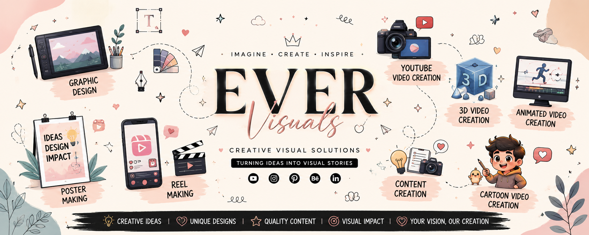

<p align="center">
  
</p>
# Ever Visuals  
### Professional Creative Agency & Digital Branding Platform

A modern high-performance creative agency website engineered for digital branding, visual storytelling, social media marketing, and scalable business presence. Built with a strong focus on immersive UI/UX, responsive architecture, performance optimization, and modern frontend deployment practices.

---

# 🌐 Live Platform

### Production Website
https://evervisuals.netlify.app/

---

# 📌 Project Overview

Ever Visuals is a creative digital agency platform developed to help startups, creators, businesses, and brands establish a premium online presence through:

- Creative Visual Design
- Digital Branding
- Social Media Marketing
- Advertisement Campaigns
- Website Development
- Video Production
- Business Scaling Strategies

The project was built as both:
- A production-ready agency website
- A real-world frontend development project

This repository demonstrates practical implementation of:
- Modern web design
- Responsive frontend systems
- Live deployment workflows
- Branding-oriented UI architecture
- Real client-focused web experiences

---

# 🎯 Core Objectives

The primary goals behind this project were:

- Build a professional agency-grade website
- Create a visually immersive digital experience
- Develop a responsive and scalable frontend architecture
- Learn practical deployment and hosting workflows
- Establish a strong portfolio-ready development project
- Create a modern branding platform for Ever Visuals

---

# ✨ Core Features

## 🎨 Modern Branding Interface
A visually polished interface designed specifically for:
- Creative agencies
- Startup brands
- Freelancers
- Digital marketers
- Content creators

---

## 📱 Fully Responsive Design
Optimized for:
- Mobile devices
- Tablets
- Desktop systems
- Modern browsers

The layout adapts dynamically for improved user experience across all screen sizes.

---

## ⚡ Performance Optimized
- Lightweight frontend architecture
- Fast static asset loading
- Optimized media handling
- Smooth rendering experience

---

## 🌍 Production Deployment
The platform is publicly deployed and globally accessible through modern hosting infrastructure.

Deployment Stack:
- GitHub Repository Management
- Netlify Hosting Platform
- HTTPS Secure Delivery

---

## 🎬 Creative Showcase Structure
The website is structured to showcase:
- Branding services
- Marketing visuals
- Video editing work
- Website projects
- Social media creatives
- Promotional content

---

# 🛠️ Technical Architecture

The project follows a lightweight frontend architecture for maintainability and deployment efficiency.

---

# Frontend Layer

| Technology | Purpose |
|---|---|
| HTML5 | Structural layout and semantic content |
| CSS3 | Styling, responsiveness, animations |
| JavaScript | Dynamic interactions and UI functionality |

---

# Deployment Infrastructure

| Platform | Usage |
|---|---|
| GitHub | Source code management |
| Netlify | Production deployment & hosting |

---

# 📂 Project Structure

```bash
evervisuals/
│
├── index.html
│
├── assets/
│   ├── css/
│   ├── js/
│   ├── images/
│   ├── icons/
│
└── README.md
```

---

# 🧠 Development Workflow

The development lifecycle of this project included:

### Phase 1 — Website Analysis
- Frontend structure evaluation
- Asset extraction and organization
- UI architecture understanding

### Phase 2 — Frontend Reconstruction
- HTML restructuring
- Asset optimization
- Styling corrections
- Responsive alignment improvements

### Phase 3 — Deployment & Hosting
- GitHub repository creation
- Version control setup
- Netlify integration
- Production deployment

### Phase 4 — Branding & Optimization
- UI refinement
- Performance enhancement
- Creative identity alignment

---

# 🚀 Deployment Process

The project uses modern static deployment workflows for high-speed delivery and scalability.

### Hosting Workflow

```bash
Local Development
        ↓
GitHub Repository
        ↓
Netlify Continuous Deployment
        ↓
Production Website
```

---

# 🔐 Security & Accessibility

- HTTPS secure delivery
- Browser-compatible structure
- Mobile accessibility support
- Lightweight static hosting architecture

---

# 📈 Skills Demonstrated

This project demonstrates practical experience in:

- Frontend Development
- Responsive Web Design
- UI/UX Structuring
- GitHub Workflow Management
- Netlify Deployment
- Static Hosting Infrastructure
- Creative Branding Systems
- Web Asset Management
- Production Website Deployment

---

# 💼 Professional Use Cases

This project can function as:

- Creative agency website
- Personal portfolio platform
- Freelancer showcase
- Startup landing page
- Branding presentation website
- Resume-strengthening development project

---

# 🔮 Planned Future Enhancements

Upcoming improvements planned for Ever Visuals:

## 📞 Business Integrations
- WhatsApp direct communication
- Contact form system
- Client inquiry management

## 📸 Portfolio Expansion
- Dedicated client showcase section
- Video project gallery
- Case study pages

## ⚙️ Advanced Features
- Admin dashboard
- Blog management system
- Dynamic project updates
- SEO optimization
- Analytics integration

## 🌐 Branding Improvements
- Custom domain integration
- Performance optimization
- Enhanced animations
- Advanced motion design

---

# 📊 Development Highlights

### Key Achievements
- Successfully deployed production website
- Implemented responsive frontend architecture
- Established professional creative branding
- Built scalable hosting workflow
- Created portfolio-grade web project

---

# 👨‍💻 Developer & Brand

### Developed By
Snehal Khandare

### Brand
Ever Visuals

### Official Website
https://evervisuals.netlify.app/

---

# 📄 License

This project is developed for:
- Branding purposes
- Educational learning
- Portfolio development
- Creative agency presentation
- Professional digital showcase

© 2026 Ever Visuals. All Rights Reserved.
